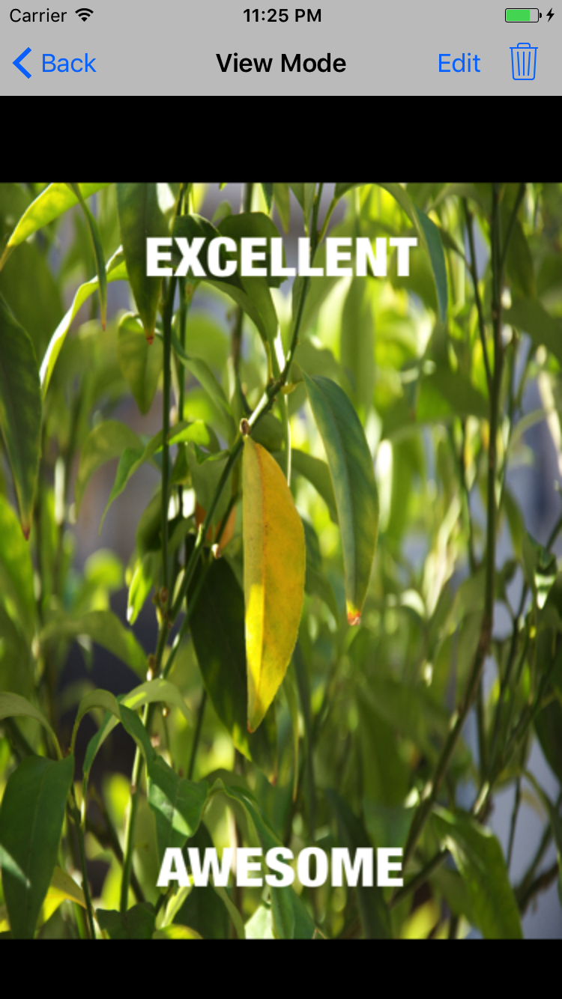
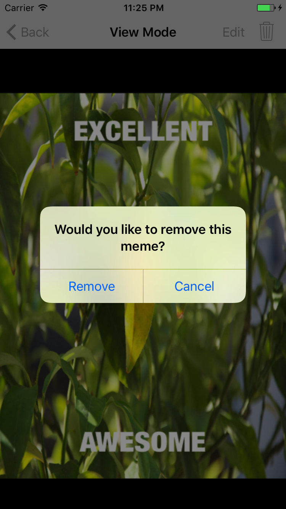
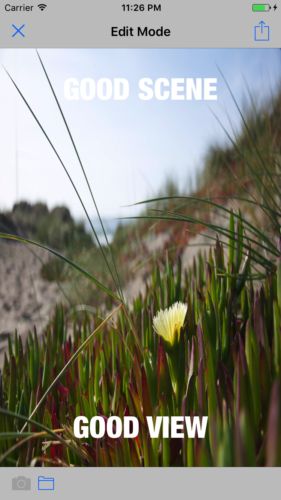

# MemeMe_Pilhwan

## 기본 기능
* Meme 생성 기능
* 생성한 Meme를 ActivityController 통해 다른 기능과 Meme 공유
* 만들어진 Meme List를 Table 혹은 Collection 형식으로 보여줌

## Kick

### Local에서 Meme data 저장
* NSKeyedArchiver / NSKeyedUnArchiver 를 이용하여 사용자가 만든 meme를 file로 저장합니다. 영구적으로 사용자가 만든 meme를 저장합니다.
* object를 NSCoding 프로토콜에 따라 encoding/decoding 처리를 하여 완료했습니다. 

#### Reference
* [tryhelloworld / 스위프트 입문(링고스타) - 아카이브](http://tryhelloworld.co.kr/courses/ios-swift입문/lessons/아카이브1)
* [how to save and load objects with nskeyedarchiver and nskeyedunarchiver](https://www.hackingwithswift.com/example-code/system/how-to-save-and-load-objects-with-nskeyedarchiver-and-nskeyedunarchiver)

### View Mode

  
  

* Collection or Table View 에서 하나의 Meme를 선택을 하면 View Mode 화면으로 전환됩니다. 
* 기존의 Meme 엡은 Collection / Table View 에서 만들어진 Meme를 자세히 볼 수 없었는데 이 화면으로 볼 수 있습니다.
* 이미 만들어진 Meme를 변경(아래 Edit Mode 이동) 또는 삭제 할 수 있는 기능도 추가 되어 있습니다.

### Edit Mode

  
  

* 이미 만든 Meme를 편집 할 수 있는 화면입니다. 기존의 Meme 추가 화면을 기능 확장해 편집 기능으로도 사용할 수 있도록 변경 했습니다.

## 시연 영상

